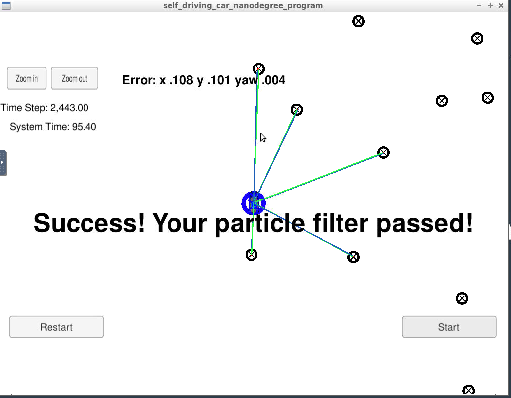

# Kidnapped Vehicle Localization via Particle Filters
This project implements a 2 dimensional particle filter in C++ to localize the position of a kidnapped vehicle on a map. We start with an initial noisy GPS position and a map. Later, at each time step we update our estimates of the position using sensor and control data. 

## Input Data:
> Sense noisy position data provided by the simulator to the c++ program
- `sense_x`
- `sense_y`
- `sense_theta`

> Previous control data (velocity and yaw rate) to predict the particle's transitioned state
- `previous_velocity`
- `previous_yawrate`

> Noisy observation data from the simulator, in a respective list of x/y values
- `sense_observations_x`
- `sense_observations_y`

## Output Data:
> Best particle values (used for calculating the error evaluation) provided by the c++ program to the simulator
- `best_particle_x`
- `best_particle_y`
- `best_particle_theta`

## Map Data
`data/map_data.txt` includes the position of landmarks (in meters) on an arbitrary Cartesian coordinate system. Each row has three columns
- `x_position`
- `y_position`
- `landmark_id`

# Particle Filter Code
The directory structure of this repository is as follows:

```
root
|   build.sh
|   clean.sh
|   CMakeLists.txt
|   README.md
|   run.sh
|   LICENSE
|   
|___data
|   |   
|   |   map_data.txt
|   
|   
|___src
    |   helper_functions.h
    |   main.cpp
    |   map.h
    |   particle_filter.cpp
    |   particle_filter.h
```
- main.cpp
    - Communicates with the Term 2 Simulator (see dependencies below) receiving control, sensory data and sending particle estimates. Calls `init()` / `prediction()`, `updateWeights()`, `resample()` functions at each time step.
- particle_filter.cpp
    - Implements functions below:
        - `init()`: Initializes particles with GPS estimates and Gaussian noise.
        - `prediction()`: Predicts new particle positions based on previous positions, yaw rate, delta_t and velocity. Gaussian noise is included.
        - `updateWeights()`: Updates particle weights by comparing sensory observations against predicted observations. (Sensor observations are transformed to map observations).
        - `resample()`: Particles are resampled proportional to their normalized weights using `discrete_distribution()` (http://en.cppreference.com/w/cpp/numeric/random/discrete_distribution.)
- helper_functions.h
    - Defines helper functions such as `calculateWeight()`, `dist()`, `getError()`, `transformToMap()`. 

## Run Result


The model passed the accuracy and time taken tests.

> Note: `prediction()` function can result in singularity (nan) when yaw rate is 0. This was resolved by setting yaw rate to a very small value (1e-4) when it equals 0.

## Dependencies (Udacity Term 2 Simulator, uWebSocket)

This project involves the Term 2 Simulator which can be downloaded [here](https://github.com/udacity/self-driving-car-sim/releases).

This repository requires setting up and installing [uWebSocketIO](https://github.com/uWebSockets/uWebSockets) for either Linux or Mac systems. For windows you can use either Docker, VMware, or even [Windows 10 Bash on Ubuntu](https://www.howtogeek.com/249966/how-to-install-and-use-the-linux-bash-shell-on-windows-10/) to install uWebSocketIO. Please see the uWebSocketIO Starter Guide page in the classroom within the EKF Project lesson for the required version and installation scripts.

## Other Important Dependencies

* cmake >= 3.5
  * All OSes: [click here for installation instructions](https://cmake.org/install/)
* make >= 4.1 (Linux, Mac), 3.81 (Windows)
  * Linux: make is installed by default on most Linux distros
  * Mac: [install Xcode command line tools to get make](https://developer.apple.com/xcode/features/)
  * Windows: [Click here for installation instructions](http://gnuwin32.sourceforge.net/packages/make.htm)
* gcc/g++ >= 5.4
  * Linux: gcc / g++ is installed by default on most Linux distros
  * Mac: same deal as make - [install Xcode command line tools](https://developer.apple.com/xcode/features/)
  * Windows: recommend using [MinGW](http://www.mingw.org/)

## Build & Run Instructions

Once the install for uWebSocketIO is complete, the main program can be built and ran by doing the following from the project top directory.

1. mkdir build
2. cd build
3. cmake ..
4. make
5. ./particle_filter

Alternatively some scripts have been included to streamline this process, these can be leveraged by executing the following in the top directory of the project:

1. ./clean.sh
2. ./build.sh
3. ./run.sh
